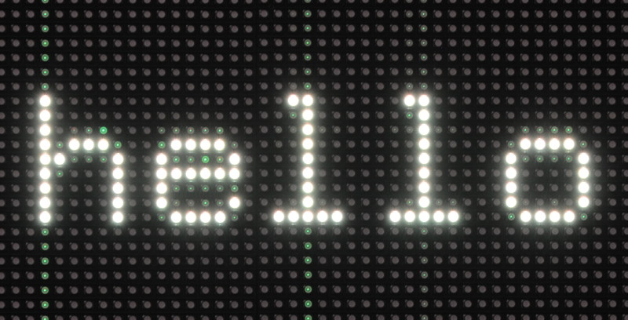
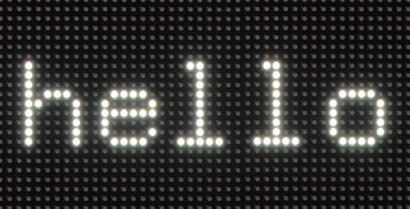

Controlling RGB LED display with Raspberry Pi GPIO
==================================================

A recreated and modified library for controlling 64x64, 32x32, or 16x32 RGB LED panels using a Raspberry Pi. Can support PWM up to 11Bit per channel, providing true 24bpp color with CIE1931 profile.
Original repo can be found [here](https://github.com/hzeller/rpi-rgb-led-matrix).

Supports 3 chains with many panels each on a regular Pi, as per the original repo's README.
Raspberry Pi 2 or 3 can chain 12 panels in that chain (36 panels total), with 96-ish panels (32 chain length) being potentially possible.
Fewer colors or so-called 'outdoor panels' can control even more, faster.

Overview
--------
The RGB LED matrix panels can be bought at [Sparkfun][sparkfun], [AdaFruit][ada] or eBay and Aliexpress. If located in China, try to get directly from some manufacturer, Taobao or Alibaba.

The `RGBMatrix` class in `include/led-matrix.h` is what controls these.
Go to [utils/directory for some ready-made tools](./utils) to get started using the library, or the [examples-api-use/](./examples-api-use/) directory if you want to get started programming your own utils.

Raspberry Pi up to 4 supported
------------------------------

This library supports the old Raspberry Pi's Version 1 with 26 pin header and also the B+ models, the Pi Zero, Raspberry Pi 2 and 3 with 40 pins, as well as the Compute Modules which have 44 GPIOs.

The Raspberry Pi 5 still needs some research into the vastly changed peripherals and is not yet supported. See https://github.com/hzeller/rpi-rgb-led-matrix/issues/1603#issuecomment-2624713250 and https://github.com/adafruit/Adafruit_Blinka_Raspberry_Pi5_Piomatter

The 26 pin models can drive one chain of RGB panels, the 40 pin models **up to three** chains in parallel (each chain 12 or more panels long). The Compute Module can drive **up to 6 chains in parallel**. The Raspberry Pi 2 and 3 are faster and generally preferred to the older models (and the Pi Zero). With the faster models, the panels sometimes can't keep up with the speed; check out this [troubleshooting section](#troubleshooting) for what to do.

A lightweight, non-GUI, distribution such as [DietPi] is recommended. [Raspbian Lite][raspbian-lite] is a bit easier to get started with and is a good second choice.

Types of Displays
-----------------
There are various types of displays that come all with the same Hub75 connector. They vary in the way the multiplexing is happening so this library supports options to choose that.
All these are configured by flags (or, programmatically, in an [Options struct](include/led-matrix.h#L57)).

If you have a 64x32 display, you need to supply the flags `--led-cols=64 --led-rows=32` for instance.

Depending on the Matrix, there are various configuration options that you might need to set for it to work. See further below in the README for the [detailed description of these](#changing-parameters-via-command-line-flags). While the `--led-rows` and the `--led-cols` can be derived from simply looking at the panels, the other options might require some experimenting to find the right setting if there is no description provided by the manufacturer of the panel. Going through these options for experiments would typically not do harm, so feel free to experiment to find your setting.

Flag                                | Description
:---------------      | :-----------------
`--led-cols`          | Columns in the LED matrix, the 'width'.
`--led-rows`          | Rows in the LED matrix, the 'height'.
`--led-multiplexing`  | In particular bright outdoor panels with small multiplex ratios require this. Often an indicator: if there are fewer address lines than expected: ABC (instead of ABCD) for 32 high panels and ABCD (instead of ABCDE) for 64 high panels.
`--led-row-addr-type` | Adressing of rows; in particular panels with only AB address lines might indicate that this is needed.
`--led-panel-type`    | Chipset of the panel. In particular if it doesn't light up at all, you might need to play with this option because it indicates that the panel requires a particular initialization sequence.

Panels can be chained by connecting the output of one panel to the input of the next panel. You can chain quite a few together, but the refresh rate will reduce with longer chains.

The 64x64 matrixes typically come in two kinds: with 5 address lines (A, B, C, D, E), or (A, B); the latter needs a `--led-row-addr-type=1` parameter. So-called 'outdoor panels' are typically brighter and allow for faster refresh-rate for the same size, but do some multiplexing internally of which there are a few types out there; they can be chosen with the `--led-multiplexing` parameter.

There are some panels that have a different chip-set that the default HUB75. These require some initialization sequence. The current supported types are `--led-panel-type=FM6126A` and `--led-panel-type=FM6127`.
Generally, the higher scan-rate (e.g.1:8), a.k.a. outdoor panels generally allow faster refresh rate, but you might need to figure out the multiplexing mapping if one of the three provided does not work.

Some 32x16 outdoor matrixes with 1:4 scan(e.g. [Quangli Q10(1/4) or X10(1/4)](http://qiangliled.com/products-63.html)) have 4 address line (A, B, C, D). For such matrices is necessary to use the `--led-row-addr-type=2` parameter. Also the matrix Quangli Q10(1/4) has "Z"-stripe pixel mapping and in this case, you'd use two parameters at the same time: `--led-row-addr-type=2 --led-multiplexing=4`.

------------
This documentation is split into parts that help you through the process:

    1. [**Wire up the matrix to your Pi**](./wiring.md). This document describes what goes where. You might also be interested in [breakout boards](./adapter) for that. If you have an [Adafruit HAT] or [Adafruit Bonnet], you can choose that with a command line option [described below](#if-you-have-an-adafruit-hat-or-bonnet)
    2. Run a demo. You find that in the [examples-api-use/](./examples-api-use/#running-some-demos) directory:
```
make -C examples-api-use
sudo examples-api-use/demo -D0
```
    3. Use the utilities. The [utils](./utils/) directory has some ready-made useful utilities to show content. [Go there](./utils/) to see how to compile and run these.
    4. Write your own proframs using the Matrix in C++ or one of the bindings such as Python or C#.

### Wiring / Boards

Please see the [Adapter Boards or Self Wiring](./adapter).

Summary:
- Yes you can self wire without level shifters and it will work most of the time, but if you're not in a hurry, get a board
- [This article](https://www.electrodragon.com/product/rgb-matrix-panel-drive-board-for-raspberry-pi-v2/) **is the recommended solution with 3 channels and level shifters.** You can't go wrong there, but expect a bit of shipping time.
- If shipping time is crucial and you don't want to wire your own, Adafruit sells a single channel board (the electrodragon one is 3 channels), but note that its wiring is non-standard and requires a special compile option or command line argument: https://www.adafruit.com/product/3211

### Utilities

The [utils directory](./utils/) is meant for ready utilities to show images or animated gifs or videos. Read the [README](./utils/README.md) for instructions how to compile.

### API

The library comes as an API that you can use for your own utilities and use-cases.

    * The native library is a C++ library (see [include/](./include/)). Example uses you find in the [examples-api-use/](./examples-api-use/) directory.
    * If you prefer to program in C, there is also a [C API](./include/led-matrix-c.h).
    * In the [python](./bindings/python) subdirectory, you'll find a Python API including a couple of [examples](./bindings/python/samples) to get started.

### Changing parameters via command-line flags

For the programs in this distribution and also automatically in your programs using this library, there are a lot of parameters provided as command line flags so that you don't have to re-compile your programs to tweak them. Some might need to be changed for your particular kind of panel.

Here is a small run-down of what these command-line flags do and when you'd like to change them.

First: if you have a different wiring than described in [wiring](./wiring.md), for instance if you have an Adafruit HAT/Bonnet, you can choose these here:

```
--led-gpio-mapping=<gpio-mapping>: Name of GPIO mapping used. Default "regular"
```

This can have values such as
    - `--led-gpio-mapping=regular`          The standard mapping of this library, described in the [wiring](./wiring.md) page.
    - `--led-gpio-mapping=adafruit-hat`     The Adafruit HAT/Bonnet that uses this library, or
    - `--led-gpio-mapping=adafruit-hat-pwm` Adafruit HAT with the anti-flicker hardware mod [described below](#improving-flicker).
    - `--led-gpio-mapping=compute-module`   Additional 3 parallel chains can be used with the Compute Module.

Learn more about the mappings in the [wiring documentation](wiring.md#alternative-hardware-mappings).

#### GPIO speed

```
--led-slowdown-gpio=<0..4>: Slowdown GPIO. Needed for faster Pis and/or slower panels (Default: 1).
```

The Raspberry Pi starting with Pi2 are putting out data too fast for almost all LED panels seen. In this case, you want to slow down writing to GPIO. Zero for this parameter means 'no slowdown'.

The default 1 (one) typically works fine, but often you have to go even further by setting it to 2 (two). If you have a Raspberry Pi with a slower processor (Model A, A+, B+, Zero), then a value of 0 (zero) might work and is desirable.

A Raspberry Pi 3 or Pi4 might even need higher values for the panels to be happy.

#### Panel Connection
The next most important flags describe the type and number of displays connected:

```
--led-rows=<rows>           : Panel rows. Typically 8, 16, 32, or 64. (Default: 32).
--led-cols=<cols>           : Panel columns. Typically 32 or 64. (Default: 32).
--led-chain=<chained>       : Number of daisy-chained panels. (Default: 1).
--led-parallel=<parallel>   : For A/B+ models of RPi2,3b: parallel chains. range=1..3 (Default: 1, 6 for Compute Module).
```

These are the most important ones: here you choose how many panels you have connected and how many rows are in each panel. Panels can be chained (each panel has an input and output connector, see the [wiring documentation](wiring.md#chains)) -- the `--led-chain` flag tells the library how many panels are chained together. The newer Raspberry Pis allow to connect multiple chains in parallel, the `--led-parallel` flag tells it how many there are.

This illustrates what each of these parameters mean:

<a href="wiring.md#chaining-parallel-chains-and-coordinate-system"></a>

##### Panel Type

Typically, panels should just work out of the box, but some panels use a different chip-set that requires some initialization. If you don't see any output on your panel, try setting:

```
--led-panel-type=FM6126A
```

Some panels have the FM6127 chip, which is also an option.

##### Multiplexing
If you have some 'outdoor' panels or panels with different multiplexing, the following will be useful:

```
--led-multiplexing=<0..17> : Mux type: 0=direct; 1=Stripe; 2=Checkered...
```

The outdoor panels have different multiplexing which allows them to be faster and brighter, but by default their output looks jumbled up. They require some pixel-mapping of which there are a few types you can try and hopefully one of them works for your panel; The default=0 is no mapping ('standard' panels), while 1, 2, ... are different mappings to try with. If your panel has a different mapping, you find everything you need to implement one in [lib/multiplex-mappers.cc](lib/multiplex-mappers.cc).

Note that you have to set the `--led-rows` and `--led-cols` to the rows and columns that are physically on each chained panel so that the multiplexing option can work properly. For instance a `32x16` panel with `1:4` multiplexing would be controlled with `--led-rows=16 --led-cols=32 --led-multiplexing=1` (or whatever multiplexing type your panel is, so it can also be `--led-multiplexing=2` ...).

For `64x32` panels with `1:8` multiplexing, this would typically be `--led-rows=32 --led-cols=64 --led-multiplexing=1`; however, there are some panels that internally behave like two chained panels, so then you'd use `--led-rows=32 --led-cols=32 --led-chain=2 --led-multiplexing=1`;

```
--led-row-addr-type=<0..4>: 0 = default; 1 = AB-addressed panels; 2 = direct row select; 3 = ABC-addressed panels; 4 = ABC Shift + DE direct (Default: 0).
```

This option is useful for certain 64x64 or 32x16 panels. For 64x64 panels that only have an `A` and `B` address line, you'd use `--led-row-addr-type=1`. This is only tested with one panel so far.

For 32x16 outdoor panels that have 4 address lines (A, B, C, D), it is necessary to use `--led-row-addr-type=2`.

#### Panel Arrangement

```
--led-pixel-mapper  : Semicolon-separated list of pixel-mappers to arrange pixels.
```

Optional params after a colon e.g. "U-mapper;Rotate:90"

Available | Parameter after colon| Example
----------|----------------------|----------
Mirror    | `H` or `V` for horizontal/vertical mirror. | `Mirror:H`
Rotate    | Degrees.                                   | `Rotate:90`
U-mapper  | -

Mapping the logical layout of your boards to your physical arrangement. See
more in [Remapping coordinates](./examples-api-use#remapping-coordinates).

#### Misc Options

```
--led-brightness=<percent>: Brightness in percent (Default: 100).
```

Self explanatory.

```
--led-pwm-bits=<1..11>    : PWM bits (Default: 11).
```

The LEDs can only be switched on or off, so the shaded brightness perception is achieved via PWM (Pulse Width Modulation). In order to get a good 8bit per color resolution (24bit RGB), the 11 bits default per color are good (Why? Because our eyes are actually perceiving brightness logarithmically, so we need a lot more physical resolution to get 24bit sRGB).

With this flag, you can change how many bits it should use for this; lowering it means the lower bits (=more subtle color nuances) are omitted. Typically you might be mostly interested in the extremes: 1bit for situations that only require 8 colors (e.g. for high contrast text displays) or 11bit for everything else (e.g. showing images or videos). Why would you bother at all? Lower number of bits use slightly less CPU and result in a higher refresh rate.

```
--led-show-refresh        : Show refresh rate.
```

This shows the current refresh rate of the LED panel, the time to refresh a full picture. Typically, you want this number to be pretty high, because the human eye is pretty sensitive to flicker. Depending on the settings, the refresh rate with this library is typically in the hundreds of Hertz, but can drop low with very long chains. Humans have different levels of perceiving flicker - some are fine with 100Hz refresh, others need 250Hz. So if you are curious, this gives you the number (shown on the terminal).

The refresh rate depends on a number of different factors, from `--led-rows` and `--led-chain` to `--led-pwm-bits`, `--led-pwm-lsb-nanoseconds`, and `--led-pwm-dither-bits`. If you are tweaking these parameters, showing the refresh rate can be a useful tool.

```
--led-limit-refresh=<Hz>  : Limit refresh rate to this frequency in Hz. Useful to keep a
                            constant refresh rate on loaded system. 0=no limit. Default: 0
```

This allows to limit the refresh rate to a particular frequency to approach a fixed refresh rate.

This can be used to mitigate some situations in which you have a faint flicker, which can happen due to hardware events (network access) or other situations such as other IO or heavy memory access by other processes. Also when you see wildly changing refresh frequencies with `--led-show-refresh`.

You trade a slightly slower refresh rate and display brightness for less visible flicker situations.

For this to calibrate, run your program for a while with --led-show-refresh and watch the line that shows the current refresh rate and minimum refresh rate observed. So wait a while until that value doesn't change anymore (e.g. a minute, so that you catch tasks that happen once a minute, such as ntp updated). Use this as a guidance what value to choose with `--led-limit-refresh`.

The refresh rate will now be adapted to always reach this value between frames, so faster refreshes will be slowed down, but the occasional delayed frame will fit into the time-window as well, thus reducing visible brightness fluctuations.

You can play with value a little and reduce until you find a good balance between refresh rate and flicker suppression.

Use this also if you want to have a stable baseline refresh rate when using the vsync-multiple flag `-V` in the [led-image-viewer] or [video-viewer] utility programs.

```
--led-no-busy-waiting     : Don't use busy waiting when limiting refresh rate.
```

This allows to switch from busy waiting to sleep waiting when limiting the refresh rate (`--led-limit-refresh`).

By default, refresh rate limiting uses busy waiting, which is CPU intensive but gives most accurate timings. This is fine for multi-core boards.

On single core boards (e.g. Raspberry Pi Zero) busy waiting makes the system unresponsive for other/background tasks. There, sleep waiting improves the system's responsiveness at the cost of slightly less accurate timings.

```
--led-scan-mode=<0..1>    : 0 = progressive; 1 = interlaced (Default: 0).
```

This switches from progressive scan and interlaced scan. The latter might look to be a little nicer when you have a very low refresh rate, but typically it is more annoying due to the comb-effect.

```
--led-pwm-lsb-nanoseconds : PWM Nanoseconds for LSB (Default: 130)
```

This allows to change the base time-unit for the on-time in the lowest significant bit in nanoseconds. Lower values will allow higher frame-rate, but will also negatively impact quality in some panels (less accurate color or more ghosting).

Good values for full-color display (PWM=11) are somewhere between 100 and 300.

If you use reduced bit color (e.g. PWM=1) and have sharp contrast applications, then higher values might be good to minimize ghosting.

How should you decide? Just leave the default if things are running fine. However, some panels have trouble with sharp contrasts and short pulses that results in ghosting. It is particularly apparent in situations such as bright text on black background. In these cases, increase the value until you don't see the ghosting anymore.

The following example shows how this might look like:

Ghosting with low --led-pwm-lsb-nanoseconds  | No ghosting after tweaking
---------------------------------------------|------------------------------
                   |

If you tweak this value, watch the framerate (`--led-show-refresh`) while playing
with this number.

```
--led-pwm-dither-bits   : Time dithering of lower bits (Default: 0)
```

The lower bits can be time dithered, i.e. their brightness contribution is achieved by only showing them some frames (this is possible because the PWM is implemented as binary code modulation). This will allow higher refresh rate (or same refresh rate with increased `--led-pwm-lsb-nanoseconds`). The disadvantage could be slightly lower brightness, in particular for longer chains, and higher CPU use. CPU use is not of concern for Raspberry Pi 2 or 3 (as we run on a dedicated core anyway) but probably for Raspberry Pi 1 or Zero. Default: no dithering; if you have a Pi 3 and struggle with low frame-rate due to high multiplexing panels (1:16 or 1:32) or long chains, it might be worthwhile to try.

```
--led-no-hardware-pulse   : Don't use hardware pin-pulse generation.
```

This library uses a hardware subsystem that also is used by the sound. You can't use them together. If your panel doesn't work, this might be a good start to debug if it has something to do with the sound subsystem (see Troubleshooting section). This is really only recommended for debugging; typically you actually want the hardware pulses as it results in a much more stable picture. 

```
--led-no-drop-privs       : Don't drop privileges from 'root' after initializing the hardware.
```

You need to start programs as root, as it needs to access some low-level hardware at initialization time. After that, it is typically not desirable to stay in this role, so the library then drops the privileges.

This flag allows to switch off this behavior so that you can stay root. Not recommended unless you have a specific reason for it (e.g. you need root to access other hardware or you do the privilege dropping yourself).

```
--led-daemon              : Make the process run in the background as daemon.
```

If this is set, the program puts itself into the background (running as 'daemon'). You might want this if started from an init script at boot-time.

```
--led-inverse             : Switch if your matrix has inverse colors on.
--led-rgb-sequence        : Switch if your matrix has led colors swapped (Default: "RGB")
```

These are if you have a different kind of LED panel in which the logic of the color bits is reversed (`--led-inverse`) or where the Red, Green, and Blue LEDs are mixed up (`--led-rgb-sequence`). You know it when you see it.

Troubleshooting
---------------
Here are some tips in case things don't work as expected.

### Use minimal Raspbian distribution
In general, run a minimal configuration on your Pi.

    * Do not use a graphical user interface (even though the Raspberry Pi foundation makes you believe that you can. Using a Pi with a GUI is an extremely slow use of an otherwise perfectly good embedded device). Always operate your Raspberry Pi [headless].

    * Switch off on-board sound (`dtparam=audio=off` in `/boot/config.txt` pre-bookworm) (`dtparam=audio=off` in `/boot/firmware/config.txt` post-bookworm). External USB sound adapters work, and are much better quality anywar, so that is recommended if you happen to need sound. The on-board sound uses a timing circuit that the RGB-Matrix needs (it seems in some distributions, such as arch-linux, this is not enough and you need to explicitly blacklist the snd_bcm2835 module).

    * Don't run anything that messes in parallel with the GPIO pins, e.g. PiGPIO library/daemon or devices that use the i2c or 1-wire interface if they are on the same pins you need for the panel.

    * There are also reports that on some Pis, the one-wire protocol is enabled (w1-gpio). This will also not work (disable by removing `dtoverlay=w1-gpio` in `/boot/config.txt` pre-bookworm or in `/boot/firmware/config.txt` post-bookworm; or using `raspi-config`, Interface Options -> 1-Wire)

    * If you see some regular flickering, make sure that there is no other process running on the system that could cause that. For isntance, it is known that merely running `top` creates a faint flicker every second it updates. Or a regular ntp run can also cause flicker once a minute (switch off with `sudo timedatect1 set-ntp false`). Maybe instead you might want to run ntp at system start-up but then not regularly updating. There might be other things running regularly you don't need; consider a `sudo systemct1 stop cron` for instance. To address some irregular flicker, consider the [`--led-limit-refresh`](#misc-options) option.

    * There are probably other processes that are running that you don't need.
    ```
    sudo apt-get remove bluez bluez-firmware pi-bluetooth triggerhappy pigpio
    ```
    Take a close look at your systemd (`systemctl`) and see if there are other things running you don't need. In general, this is why starting with a minimal installation is a good idea; there is simply less cruft that you have to disable.

    * More recent versions of Raspbian Lite result in some faint brightness fluctuations of the displays and it isn't quite clear why.

The default install of **[Raspbian Lite][raspbian-lite]** or **[DietPi]** seem to be good starting points, as they have a reasonably minimal configuration to begin with. Raspbian Lite is not as lite as it used to be.

